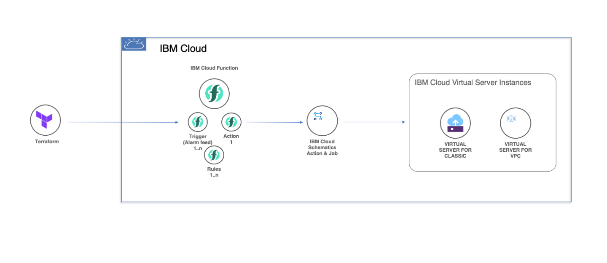

# Overview

IBM Cloud Instance Scheduler Module - Design



This module is used to Start/Stop VSI at the user provided schedule. 

The solution is built around the following IBM Cloud Services

* IBM Cloud Schematics - Ansible actions ( For Starting / Stoping VSI)
* IBM Cloud Functions ( For scheduling based on cron and invoking schematics to perform start/stop),
* IBM Cloud IAM ( To provide required permissions to the function's service id to access VSI and schematics)
* Terraform (Automate the scheduler setup in the users IBM cloud account).

And using the below software components

* Terraform IBM Modules - https://registry.terraform.io/namespaces/terraform-ibm-modules (Provision IBM Cloud resources - Function action, rule, triggers, IAM Policies, etc)
* Schematics Python SDK - https://github.com/IBM/schematics-python-sdk (Invoke schematics ansible action from IBM Function)

The user can provide the VSI IP list, Cron schedule and the action in the terraform configuration.

# Instance Scheduler Module Example

## Example Usage
```hcl
module "instance_scheduler" {
    source = "git::https://github.ibm.com/schematics-solution/terraform-ibm-instance-scheduler//module"

    inventories = var.inventories
    schedules = var.schedules

    ibmcloud_api_key = var.ibmcloud_api_key
    resource_group = var.resource_group
}
```
## Example input tfvars file
```hcl
ibmcloud_api_key=""

resource_group = "default"

inventories = {
    dev = {
        instance_ip_list = [
            "10.240.64.4"
        ]
    }
}

schedules = {

    dev_7am_start_everyday = {
        cron = "0 7 * * *"
        action = "start"
        env = "dev"
        enabled = true
    }

    dev_11pm_stop_everyday = {
        cron = "0 23 * * *"
        action = "stop"
        env = "dev"
        enabled = true
    }
}
```


<!-- BEGINNING OF PRE-COMMIT-TERRAFORM DOCS HOOK -->

## Inputs

| Name                              | Description                                           | Type   | Default | Required |
|-----------------------------------|-------------------------------------------------------|--------|---------|----------|
| ibmcloud_api_key | API key of the user | string | n/a | yes |
| resource_group | The name of the resource group under which the resources of the instance scheduler will be created | string | n/a | yes |
| inventories | User defined environment containing list of VSI ip's | map(object({<br>instance_ip_list = list(string)<br>})) | n/a | yes |
| schedules | User provided schedules with environment details and action to be performed|  map(object({<br>cron = string<br>action = start \| stop<br>env = string<br>enabled = bool<br>})) | n/a | yes |

Notes

* `inventories` variable
  * This variable is used to define the environment / group the related hosts under one key. The key name defined can be user's choice For e.g dev, stage, prod, etc
* `schedules` variable
  * The `env` key should match one of the keys defined in the `inventories` variable 
  * The `cron` key should match the standard cron format `* * * * *`
  * The `action` key can be either `start` or `stop`
* The following privileges will be automatically provided to the service id created by the instance scheduler module
  | Service | Privilege | Purpose |
  |---------|-----------|----------|
  | Schematics | Manager | Required for creating schematics actions and jobs |
  | Infrastructure Services | Editor | Required for starting and stopping VSI's |

<!-- END OF PRE-COMMIT-TERRAFORM DOCS HOOK -->

# Note

This module requires terraform version v0.14 and above as the module uses the latest features available as part of terraform v0.14